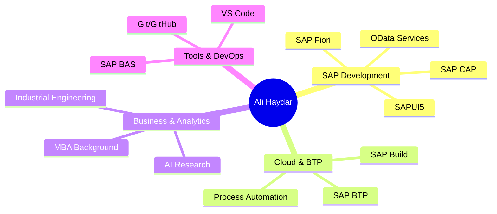

<div align="center">
  
# 👨‍💻 Ali Haydar Sayar

### SAP Fiori Developer | SAPUI5 & OData Expert | JavaScript, Node.js | SAP BTP, SAP BUILD

[](https://www.linkedin.com/in/ali-haydar-sayar/)
[](https://alihaydarsayar.com/)
[](mailto:alihaydarsyr@gmail.com)


</div>

---

## 🎯 About Me

Results-driven **SAP Fiori Developer** with **4+ years** of hands-on experience delivering enterprise-grade applications across **manufacturing, energy, and retail** industries. Based in **Istanbul, Turkey** 🇹🇷

```javascript
const ali = {
    role: "SAP Fiori Developer",
    company: "GoLive Yazılım A.Ş.",
    location: "Istanbul, Turkey",
    education: ["MBA", "B.Sc. Industrial Engineering"],
    projectsDelivered: "15+ Major S/4HANA Projects",
    clients: ["Erdemir", "Petkim", "Karaca", "Zorlu", "Milangaz", "Çalık"],
    passions: ["Chess ♟️", "Photography 📸", "AI Research 🤖"]
};
```

---

## 🛠️ Technology Stack

<div align="center">

### Frontend Development


### Backend & Cloud


### Tools & Platforms


### Analytics & Other


</div>

---

## 💼 Professional Experience

<table>
<tr>
<td width="50%">

### 🚀 Current Role
**SAP Fiori Developer**  
*GoLive Yazılım A.Ş.*  
📅 Jan 2022 - Present

- ✨ Developed **15+ major S/4HANA projects**
- 🔧 Built custom SAPUI5 applications
- ⚡ Designed & implemented OData services
- 🎨 Enhanced UX with SAP Fiori
- ☁️ SAP BTP development & integration

</td>
<td width="50%">

### 📊 Key Achievements
- 🏆 **SAP Certified Associate**
- 📈 Delivered solutions for Fortune 500 clients
- 🔄 Seamless S/4HANA migrations
- 🚀 Low-code automation with SAP Build
- 💡 Published AI research (ANN)

</td>
</tr>
</table>

---

## 🎓 Education & Certifications

<details>
<summary><b>🎯 Click to expand Education</b></summary>

### 🎓 Academic Background
- **M.Sc. Business Administration** - Kocaeli University (2022-2023)
- **B.Sc. Industrial Engineering** - Kocaeli University (2016-2020)

### 🏆 SAP Certifications
- ✅ **SAP Certified Associate - Low-Code/No-Code Developer (SAP Build)** - Jun 2025
- ✅ **Creating Applications with SAP Build Code** - Mar 2024
- ✅ **Generative AI at SAP** - Mar 2024
- ✅ **SAP Build No-Code Automation** - Feb 2024

</details>

---

## 📈 Featured Projects

<div align="center">

| Project | Type | Duration | Tech Stack |
|---------|------|----------|------------|
| 🏭 **Erdemir S/4HANA** | Custom Fiori Apps | Apr 2025 - Present | SAPUI5, OData, BTP |
| ⚡ **Petkim S/4HANA** | Custom Fiori Apps | Aug 2024 - Present | SAP Fiori, CAP |
| 🔥 **Milangaz S/4HANA** | Custom Fiori Apps | Apr 2024 - Present | SAPUI5, JavaScript |
| 🏠 **Karaca S/4HANA** | Standard Fiori Apps | Sep 2023 - Present | SAP Fiori Elements |
| 🤖 **SAP Build Next Level** | Vendor Portal | Jan 2024 - Sep 2024 | SAP Build Apps |

</div>

---

## 📊 GitHub Analytics

<div align="center">
  


</div>

<div align="center">
  
[](https://git.io/streak-stats)

</div>

---

## 🌟 Highlighted Skills



---

## 📝 Recent Publications

- 📄 **Request Forecast With Artificial Neural Networks** - CEOSSC 2020
- 📊 **Students' Time Management & Academic Success** - 2019

---

## 💡 What I'm Currently Learning

<div align="center">


</div>

---

## 🤝 Let's Connect!

<div align="center">

I'm always open to interesting conversations and collaboration opportunities!

[](https://www.linkedin.com/in/ali-haydar-sayar/)
[](https://alihaydarsayar.com/)
[](mailto:alihaydarsyr@gmail.com)

### 📍 Istanbul, Turkey | 🌍 Open to Remote Opportunities

---


</div>
