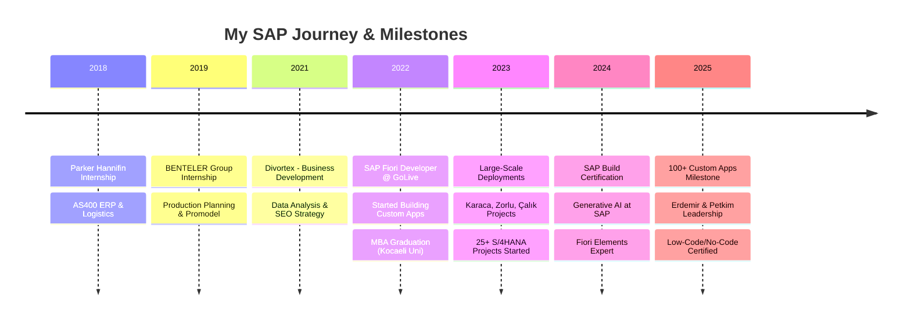
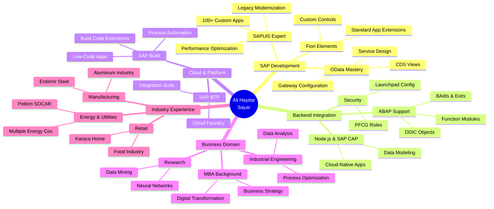

<div align="center">

# 👋 Hi, I'm Ali Haydar Sayar


### 🏗️ Architecting Scalable Enterprise Solutions in the SAP Ecosystem

[](https://www.linkedin.com/in/ali-haydar-sayar/)
[](https://alihaydarsayar.com/)
[](mailto:alihaydarsyr@gmail.com)
[](https://github.com/alihaydarsayar)


</div>

---

## 🎯 About Me

> **Technology-driven SAP Fiori Developer & Industrial Engineer**  
> I specialize in architecting and coding scalable, high-performance web applications within the SAP ecosystem.  
> My core expertise lies in **SAPUI5** and **JavaScript**, bridging the gap between complex backend integrations (OData) and intuitive frontend interfaces.

```typescript
const aliHaydar = {
    role: "SAP Fiori Developer",
    company: "GoLive Yazılım A.Ş.",
    location: "Istanbul, Turkey 🇹🇷",
    experience: "4+ years of hands-on coding",
    
    achievements: {
        customApps: "100+ Custom Fiori Applications",
        projects: "25+ Enterprise Projects Delivered",
        clients: ["Erdemir", "Petkim (SOCAR)", "Karaca", "Zorlu Energy", 
                  "Çalık Holding", "Milangaz", "KEDS Kosovo"]
    },
    
    education: {
        masters: "MBA - Business Administration",
        bachelors: "Industrial Engineering",
        approach: "Engineering precision + Web development agility"
    },
    
    expertise: [
        "I don't just configure standard screens",
        "I build custom, user-centric Fiori apps from scratch 🚀"
    ],
    
    currentMission: "Replacing legacy systems with modern, scalable interfaces",
    
    philosophy: "Bridge the gap between complex backends and intuitive frontends"
};
```

<div align="center">

### 💼 **Currently Building**

`100+ Custom Apps` • `25+ S/4HANA Projects` • `Cloud-Native Solutions` • `Enterprise Digital Transformation`

</div>

---

## 🛠️ Technical Arsenal

<div align="center">

### 🎨 Frontend Development


### ⚙️ Backend & Integration


### ☁️ Cloud & Platform


### 🛠️ Development Tools


### 🔐 Security & Configuration


### 📊 Analytics & Research


</div>

---

## 💼 Professional Experience

<div align="center">



</div>

### 🏢 GoLive Yazılım A.Ş. | SAP Fiori Developer
**January 2022 - Present (4+ years)**

<details open>
<summary><b>🎯 Key Responsibilities & Achievements</b></summary>

#### 🚀 Large-Scale Custom Development
- **Architected and deployed 100+ custom Fiori applications** across 25+ projects using SAPUI5 and JavaScript
- Successfully **replaced legacy systems** with modern, user-centric interfaces
- Delivered end-to-end solutions for Manufacturing, Energy, and Retail sectors

#### 🔧 Technical Leadership
- **Fiori Extensibility & Backend Logic**: Extended Standard Fiori Apps and implemented backend enhancements via BAdIs, ABAP Functions, and DDIC objects (Tables/Structures)
- **Modern Backend & Data Modeling**: Designed high-performance OData Services and CDS Views
- Utilized **Node.js and SAP CAP** for cloud-native scenarios and advanced data modeling

#### 🔐 Security & Configuration
- Managed **Fiori Launchpad configurations** (Catalogs, Groups)
- Handled **role-based access assignments (PFCG)** for secure application deployment

#### ☁️ Cloud & Innovation
- Implemented solutions on **SAP BTP** (Business Technology Platform)
- Leveraged **SAP Build for Low-Code development** (Certified)
- Experience in developing UI layers for **SAP MII/ME** in heavy industry environments

</details>

<details>
<summary><b>🏆 Major Clients & Projects</b></summary>

| Client | Industry | Type | Status |
|--------|----------|------|--------|
| 🏭 **Erdemir** | Steel Manufacturing | Custom S/4HANA Apps | Active |
| ⚡ **Petkim (SOCAR)** | Petrochemical | Custom S/4HANA Apps | Active |
| 🏪 **Karaca** | Retail | Custom S/4HANA Apps | Active |
| 🔥 **Milangaz** | Energy Distribution | Custom S/4HANA Apps | Active |
| ⚡ **Zorlu Energy** | Energy | Custom Support Apps | Active |
| 🏗️ **Çalık Holding** | Industrial Conglomerate | Custom Support Apps | Active |
| ⚡ **Yedaş/Yepaş** | Energy Distribution | Custom Apps | Delivered |
| ⚡ **Oedaş** | Energy Distribution | Custom Apps | Delivered |
| 🌍 **KEDS (Kosovo)** | Energy (International) | Custom & Standard Apps | Delivered |

</details>

---

## 📊 Project Portfolio

<div align="center">

### 📈 Impact by Numbers

| Metric | Achievement |
|--------|-------------|
| **Custom Applications** | 100+ Fiori Apps Built from Scratch |
| **Enterprise Projects** | 25+ S/4HANA Implementations |
| **Client Industries** | Manufacturing, Energy, Retail, Utilities |
| **Years of Experience** | 4+ Years of Professional Development |
| **Certifications** | 4 SAP Certifications (Build, AI, Fiori) |

</div>

<details open>
<summary><b>🏭 Manufacturing & Heavy Industry</b></summary>

| Project | Client | Scope | Duration | Tech Stack |
|---------|--------|-------|----------|------------|
| **Erdemir S/4HANA** | Steel Giant | 100+ Custom Fiori Apps | Apr 2025 - Present | SAPUI5, OData, CDS, BTP |
| **Sistem Alüminyum** | Aluminum Manufacturing | Standard Fiori Apps | May 2023 - Jul 2024 | Fiori Elements, OData |
| **Teknik Alüminyum** | Aluminum Manufacturing | Standard Fiori Apps | Mar 2022 - Jan 2023 | Fiori Elements |

</details>

<details>
<summary><b>⚡ Energy & Utilities</b></summary>

| Project | Client | Scope | Duration | Tech Stack |
|---------|--------|-------|----------|------------|
| **Petkim (SOCAR)** | Petrochemical | Custom S/4HANA Apps | Aug 2024 - Present | SAPUI5, SAP CAP, RAP |
| **Milangaz** | LPG Distribution | Custom S/4HANA Apps | Apr 2024 - Present | SAPUI5, JavaScript, OData |
| **Zorlu Energy** | Energy Conglomerate | Custom Support Apps | Jul 2022 - Present | SAPUI5, BTP |
| **KEDS Kosovo** | Energy (International) | Rise S/4HANA | Jun 2023 - Present | Custom & Standard Fiori |
| **Yedaş/Yepaş** | Energy Distribution | Custom Apps | Ongoing | SAPUI5, OData |
| **Oedaş** | Energy Distribution | Custom Support Apps | Jan 2023 - Present | SAPUI5 |
| **Çorumgaz** | Natural Gas | ISU S/4HANA | Jan 2022 - Jan 2023 | Custom & Standard Fiori |
| **Entek** | Energy | S/4HANA Upgrade | Oct 2022 - Feb 2023 | Custom & Standard Fiori |

</details>

<details>
<summary><b>🏪 Retail & Consumer Goods</b></summary>

| Project | Client | Scope | Duration | Tech Stack |
|---------|--------|-------|----------|------------|
| **Karaca** | Home & Lifestyle Retail | Standard S/4HANA | Sep 2023 - Present | Fiori Elements, OData |
| **ES Global Gıda** | Food Industry | Standard S/4HANA | Apr 2023 - Aug 2023 | Fiori Elements |
| **Ishway** | Retail | Standard S/4HANA | Apr 2023 - Jul 2023 | Fiori Elements |

</details>

<details>
<summary><b>🏗️ Industrial Conglomerates</b></summary>

| Project | Client | Scope | Duration | Tech Stack |
|---------|--------|-------|----------|------------|
| **Çalık Holding** | Industrial Conglomerate | Custom Support Apps | Jul 2022 - Present | SAPUI5, BTP |
| **ICA** | Industrial | Custom Support Apps | Jan 2023 - Jul 2023 | SAPUI5 |

</details>

<details>
<summary><b>☁️ Cloud & Low-Code Solutions</b></summary>

| Project | Client | Scope | Duration | Tech Stack |
|---------|--------|-------|----------|------------|
| **SAP Build Next Level** | Internal Innovation | Vendor Portal | Jan 2024 - Sep 2024 | SAP Build Apps |
| **Eren Public Cloud** | Cloud Migration | Process Automation | Oct 2024 - May 2025 | BTP, Build Process Automation |

</details>

---

## 🎓 Education & Continuous Learning

<table>
<tr>
<td width="50%" valign="top">

### 🎓 Academic Background

**🎯 Master of Business Administration (MBA)**  
*Kocaeli University*  
📅 February 2022 - July 2023  
🎓 Business Administration

**🎯 Bachelor of Science**  
*Kocaeli University*  
📅 2016 - 2020  
🎓 Industrial Engineering

**🎓 High School**  
*Erzincan Milliyet Anadolu Öğretmen Lisesi*  
📅 2011 - 2015

</td>
<td width="50%" valign="top">

### 🏆 SAP Certifications

✅ **SAP Certified Associate**  
Low-Code/No-Code Developer - SAP Build  
📅 June 2025

✅ **Developing and Extending SAP Fiori Elements Apps**  
Record of Achievement  
📅 2024

✅ **Generative AI at SAP**  
Certification  
📅 March 2024

✅ **SAP Build No-Code Automation**  
Composing and Automating - Record of Achievement  
📅 February 2024

</td>
</tr>
</table>

---

## 📝 Research & Publications

<div align="center">

| Year | Title | Platform | Topic |
|------|-------|----------|-------|
| 2020 | **Request Forecast With Artificial Neural Networks** | CEOSSC International Congress 🇧🇦 | ANN Application for Automobile Sales |
| 2019 | **Students' Time Management Attitudes** | Research Paper | Academic Success Analysis |

**🔬 Research Interests:** Artificial Neural Networks • Data Mining • Industrial Engineering Applications

</div>

---

## 📊 GitHub Statistics

<div align="center">


[](https://git.io/streak-stats)

</div>

---

## 💡 Technical Expertise Breakdown

<div align="center">

### 🎯 Skills Proficiency

```text
SAPUI5 Development      ████████████████████░   95%  Expert Level
JavaScript (ES6+)       ████████████████████░   95%  Advanced
OData Services          ███████████████████░░   90%  Expert in Design & Activation
Frontend Integration    ███████████████████░░   90%  Backend to UI Bridge
SAP BTP & Cloud         ██████████████████░░░   85%  Cloud-Native Development
Node.js & SAP CAP       █████████████████░░░░   80%  Modern Backend
Fiori Elements          ████████████████████░   90%  Standard & Extensions
SAP Build (Low-Code)    ████████████████░░░░░   75%  Certified Developer
ABAP & CDS Views        ████████████████░░░░░   75%  Backend Support
Security & PFCG         █████████████████░░░░   80%  Role-Based Access
```

</div>

---

## 🚀 What Sets Me Apart

<div align="center">

### 🎯 My Unique Value Proposition

</div>

<table>
<tr>
<td width="33%" align="center">

#### 🏗️ Architecture Mindset
**Not Just Coding**

I don't just configure standard screens - I architect and build custom, scalable enterprise solutions from the ground up.

</td>
<td width="33%" align="center">

#### 🔗 Full-Stack Integration
**Bridge Builder**

Expert at connecting complex SAP backends (OData, CDS, ABAP) with modern, intuitive frontend experiences.

</td>
<td width="34%" align="center">

#### 📊 Business + Tech
**MBA + Engineering**

Combining business acumen with technical precision to deliver solutions that drive real business value.

</td>
</tr>
</table>

---

## 🌱 Current Focus & Learning

<div align="center">

```javascript
const currentlyExploring = {
    "Advanced Technologies": {
        "Generative AI": ["AI in SAP Ecosystem", "Copilot Integration", "LLM-Powered Apps"],
        "Cloud-Native": ["Microservices Architecture", "SAP BTP Advanced Features"],
        "Modern Frontend": ["Vue.js Advanced Patterns", "Performance Optimization"]
    },
    
    "SAP Innovations": {
        "SAP Build": ["Advanced Process Automation", "Custom Extensions with Build Code"],
        "Fiori Evolution": ["Latest Fiori Design Patterns", "Fiori Elements V4"],
        "Backend Modernization": ["Advanced CAP Features", "RAP Development"]
    },
    
    "Industry Trends": {
        "IoT Integration": "Connecting devices to SAP S/4HANA",
        "Predictive Analytics": "AI-powered business insights",
        "Real-Time Processing": "Event-driven architectures"
    }
};
```

</div>

---

## 🎯 Professional Mindmap

<div align="center">



</div>

---

## 🌍 Let's Connect & Collaborate!

<div align="center">

### 💬 Open for Interesting Conversations!

I'm passionate about building enterprise solutions that truly transform businesses.  
Whether you're looking to discuss SAP technologies, collaborate on projects, or explore innovation opportunities - let's talk!

<br/>

[](https://www.linkedin.com/in/ali-haydar-sayar/)
[](https://alihaydarsayar.com/)
[](mailto:alihaydarsyr@gmail.com)
[](https://github.com/alihaydarsayar)

<br/>

### 📍 Istanbul, Turkey | 🌐 Open to Remote & Hybrid Opportunities

---

### 🎯 What I'm Looking For

`Enterprise SAP Projects` • `Digital Transformation Initiatives` • `Cloud Migration Projects` • `Innovation Collaborations`

<br/>

### 🎨 Beyond the Code

♟️ **Chess Strategy** • 📸 **Photography** • 🎵 **Music Lover** • 🎬 **Cinema Enthusiast** • 📚 **Continuous Learner** • ⚽ **Sports Fan**

<br/>

### 📚 Top Skills (LinkedIn Endorsed)

`Industrial Engineering` • `Artificial Neural Networks` • `Data Mining` • `SAP SAPUI5` • `OData` • `JavaScript`

<br/>

### 🌐 Languages

**English** - Full Professional Proficiency  
**Turkish** - Native

</div>

---

<div align="center">

### 💡 My Philosophy

**"I don't just configure standard screens; I architect custom, scalable solutions that bridge complex backends with intuitive frontends."**

---

### ⭐ From [Ali Haydar Sayar](https://github.com/alihaydarsayar)

*Technology-driven SAP Fiori Developer combining engineering precision with modern web development agility.*

<br/>

**"The best way to predict the future is to build it."** - Peter Drucker

<br/>


</div>
